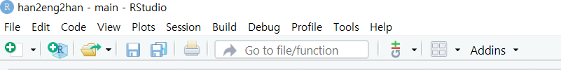

## 한타영타 변환 

* 지원하는 기능
  - 영타로 잘못친 한타를 영타로 수정하기
  - 한타로 잘못친 영타를 한타로 수정하기
  - CAPS LOCK을 누른 채 잘못친 영타 수정하기
  
* 예시


  
## 설치 방법

```
remotes::install_github('kwhkim/han2eng2han')
```
  
## dependencies

* `rstudioapi`
* `stringi`
* `KoNLP`
  
## Addsin 등록 확인

R studio 상단을 보면 Addins이 있다.



클릭하고 Han2Eng2Han이 있는지 확인하자.


여기서 `Han2Eng2Han`는 한타 또는 영타를 영타 또는 한타로 변환하고, `change_case`는 영타의 대소를 바꿔준다.

## Keyboard shortcut 등록


메뉴의 Tools - Modify Keyboard shortcuts를 선택한다.

검색으로 `han`을 치면 다음과 같이 `Han2Eng2Han`과 `change_case`의 단축키를 설정할 수 있다. `[CTRL]+[SHIFT]+[SPACE]`와 `[CTRL]+[SHIFT]+[Q]`로 설정을 권유한다. 하지만 목적과 필요에 따라 수정 가능하다. 하지만 다른 단축키와 겹치지 않도록 주의하자.


## ToDos & 다음 프로젝트

* `KoNLP` 없이도 실행되도록 하기 
  - `KoNLP`는 현재 CRAN에 등록되어 있지 않고, 초심자가 설치하기 힘들 수도 있으므로
* Visual Studio extension 만들기
* 자음, 모음의 순서가 바뀌거나, 받침 자음의 순서가 바뀐 경우에도 자동으로 수정하기 
* "LG전자"처럼 영어가 같이 포함된 경우에는 두 번 변환했을 때 영어가 보존되도록 하기(근데 그냥 CTRL+Z를 해도 되지 않을까?)

## 개발기

* [영어로 잘못 쓴 한글과 한글로 잘못 쓴 영어 1](http://ds.sumeun.org/?p=2621)
* [영어로 잘못 쓴 한글과 한글로 잘못 쓴 영어 2](http://ds.sumeun.org/?p=2624)

## Version History

* Ver 0.5
  - `library()`를 제거하고, DESCRIPTION 파일의 Depends:에 `data.table`을 추가했다. 
  - 관련 자료
    - [SO: Using data.table package inside my own package](https://stackoverflow.com/questions/10527072/using-data-table-package-inside-my-own-package)
    - [Why library() or require() should not be used in a R package](https://stackoverflow.com/questions/64737686/why-library-or-require-should-not-be-used-in-a-r-package)

* Ver 0.4 
  - 한글과 영어가 섞여 있을 때 한글은 영어로, 영어는 한글로 동시에 바꾼다.
    - 예) SK 하이닉스 -> 나 gkdlslrtm -> sk 하이닉스

* Ver 0.3 
  - `KoNLP::HangulAutomata("ㅎㅑㅅㅗㅕㅠ.ㅊㅐㅡ/ㅏㅡㅐㅕㅜㅣㅔ/ㅜㄸㅜㄸㄲ", isForceConv = TRUE, isKeystroke = FALSE)`에 대해 `Error in .jcall(KoHangulAuto, "S", "convert", input): java.lang.NullPointerException`이 발생하는 문제를 `tryCatch()`로 해결
    - `KoNLP::HangulAutomata("ㅎㅑ", isForceConv = TRUE, isKeystroke = FALSE)`의 결과와 비교. 

